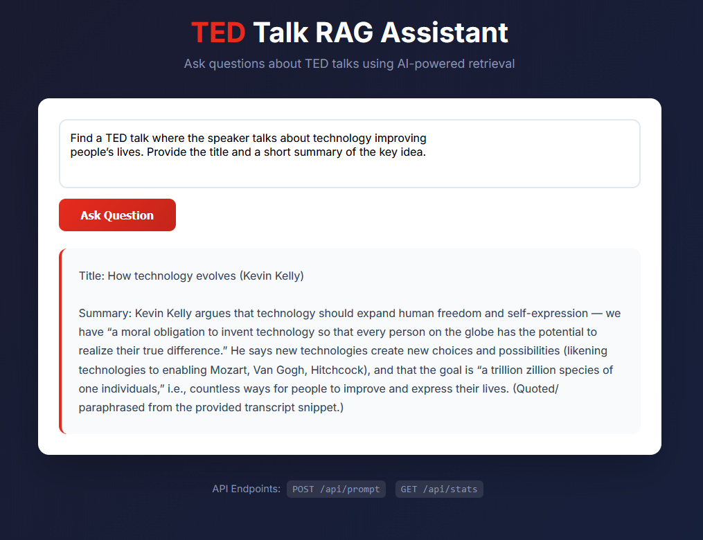

# TED Talk RAG Assistant

Ask questions about TED talks using AI-powered retrieval and get answers grounded in actual TED content.



## What is this?

This is a Retrieval-Augmented Generation (RAG) system that lets you ask questions about TED talks and get accurate answers based on the actual talk transcripts. The AI only uses information from the TED dataset - no making stuff up!

## How it works

1. **Ingestion**: TED talk transcripts are split into chunks and converted into vector embeddings
2. **Storage**: These embeddings are stored in a Pinecone vector database
3. **Retrieval**: When you ask a question, the system finds the most relevant talk chunks
4. **Generation**: An AI model (via Azure OpenAI) answers your question using only the retrieved context

## Features

- Search through TED talk transcripts using natural language
- Get answers with citations to specific talks and speakers
- View the context used to generate each answer
- API endpoints for integration into other applications

## Tech Stack

- **Backend**: Python with LangChain
- **Vector Database**: Pinecone
- **LLM**: Azure OpenAI (via llmod.ai)
- **Deployment**: Vercel
- **Data Processing**: Pandas for CSV handling

## Project Structure

```
TedAgent/
├── api/                    # API endpoints
│   ├── prompt.py          # Main Q&A endpoint
│   ├── stats.py           # Statistics endpoint
│   └── index.py           # Landing page
├── src/                   # Source code
│   └── ingestion.py       # Data ingestion pipeline
├── data/                  # TED talks dataset
│   └── ted_talks_en.csv
├── images/                # Screenshots and demos
└── requirements.txt       # Python dependencies
```

## Setup

### Prerequisites

- Python 3.8+
- Pinecone API key
- Azure OpenAI API key (or llmod.ai key)

### Installation

1. Clone this repository:
```bash
git clone https://github.com/Alon-gilad-5/TED-rag-agent.git
cd TedAgent
```

2. Create a virtual environment:
```bash
python -m venv .venv
source .venv/bin/activate  # On Windows: .venv\Scripts\activate
```

3. Install dependencies:
```bash
pip install -r requirements.txt
```

4. Create a `.env` file with your API keys:
```env
BASE_URL=https://api.llmod.ai
LLMOD_API_KEY=your_api_key_here
PINECONE_API_KEY=your_pinecone_key_here
```

5. Run the ingestion script to populate the vector database:
```bash
python src/ingestion.py
```

## Usage

### Running Locally

The application is deployed on Vercel, but you can test the API endpoints locally.

### API Endpoints

**POST /api/prompt**
```json
{
  "question": "Find a TED talk where the speaker talks about technology improving people's lives."
}
```

Response includes:
- AI-generated answer
- Context from relevant TED talks
- Talk titles, speakers, and similarity scores

## Configuration

You can adjust these settings in `src/ingestion.py`:

- `SUBSET_SIZE`: Number of talks to process (default: 200)
- `CHUNK_SIZE`: Size of text chunks (default: 1024 characters)
- `CHUNK_OVERLAP`: Overlap between chunks (default: 20%)

## How the Code Works

The codebase includes human-readable comments explaining each step. Check out:
- `api/prompt.py` - See how questions are processed and answered
- `src/ingestion.py` - Understand how TED talks are chunked and embedded

## Evaluation

The project includes an LLM-as-Judge evaluation framework to measure RAG system quality and optimize retrieval parameters.

### evaluateRag.py

Located in `evaluation/evaluateRag.py`, this script evaluates the RAG system's performance across different configurations:

**What it does:**
- Tests multiple k values (number of retrieved documents) to find the optimal retrieval setting
- Evaluates system responses across 4 query categories:
  1. **Precise Fact Retrieval** - Finding specific talks with title/speaker
  2. **Multi-Result Topic Listing** - Returning multiple relevant talks
  3. **Key Idea Summary** - Extracting and summarizing main concepts
  4. **Recommendation with Justification** - Suggesting talks with evidence-based reasoning

**Evaluation Metrics:**
- **Faithfulness** (1-5): Is the answer grounded only in the provided context?
- **Relevance** (1-5): Does the answer address the question?
- **Completeness** (1-5): Are all requirements fulfilled?
- **Context Quality** (1-5): Were the retrieved chunks useful?

**Running the evaluation:**
```bash
python evaluation/evaluateRag.py
```

The script will:
- Test each question with different k values (3, 5, 10, 12, 15)
- Use an LLM judge to score each response
- Calculate average scores across all metrics
- Recommend the optimal k value for your RAG configuration
- Save detailed results to `evaluation_results.json`

**Use this to:**
- Tune your retrieval parameters (top_k value)
- Understand system performance across different query types
- Identify areas for improvement in your RAG pipeline

## Deployment

This project is configured for Vercel deployment using `vercel.json`. Just connect your repo to Vercel and it'll deploy automatically.

## License

MIT

## Contributing

Feel free to open issues or submit PRs!
